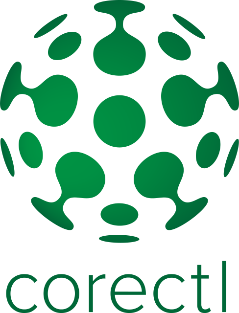

[](https://circleci.com/gh/qlik-oss/corectl)
[](https://goreportcard.com/report/qlik-oss/corectl)




Corectl is a command line tool to perform reloads, fetch metadata and evaluate expressions in Qlik Core apps.

---

## Install

### macOS

If you want to install `corectl` using brew you have to first tap our homebrew repo with the following:

```bash
brew tap qlik-oss/taps
```

after which you can install `corectl` by running:

```
brew install qlik-corectl
```

Note that the binary is still installed as `corectl`.

If you prefer, you can install using curl instead. Simply run:
```bash
 curl --silent --location "https://github.com/qlik-oss/corectl/releases/latest/download/corectl-Darwin-x86_64.tar.gz" | tar xz -C /tmp && mv /tmp/corectl /usr/local/bin/corectl
```

### Linux

If you want to install `corectl` using snap you can run:

```bash
sudo snap install qlik-corectl
```

This installs `qlik-corectl` with the alias `corectl`, so you can still use it as normal (without the `qlik-` prefix).

If you prefer, you can install using curl instead. Simply run:
```bash
 curl --silent --location "https://github.com/qlik-oss/corectl/releases/latest/download/corectl-Linux-x86_64.tar.gz" | tar xz -C /tmp && mv /tmp/corectl /usr/local/bin/corectl
```

### Windows

Using the git-bash shell you can install `corectl` with curl by running:

```bash
curl --silent --location "https://github.com/qlik-oss/corectl/releases/latest/download/corectl-windows-x86_64.zip" > corectl.zip && unzip ./corectl.zip -d "$HOME/bin/" && rm ./corectl.zip
```

You can also download the binary manually from [releases](https://github.com/qlik-oss/corectl/releases).

## Examples

This sections describes some commands and configuration that can be used with the `corectl` tool.

To simplify usage of `corectl`, basic configurations such as: engine connection details, app and objects, can be described in a configuration file.
We have added an example configuration file to this repo [here](./examples/corectl.yml).

`corectl` will automatically check for a `corectl.yml | corectl.yaml` file in your current directory, removing the need to pass the config file using flags for each command.

Example configuration:
```yaml
engine: localhost:9076 # URL and port to running Qlik Associative Engine instance
app: corectl-example.qvf # App name that the tool should open a session against.
script: ./script.qvs # Path to a script that should be set in the app
connections: # Connections that should be created in the app
  testdata: # Name of the connection
    connectionstring: /data # Connectionstring (qConnectionString) of the connection. For a folder connector this is an absolute or relative path inside of the engine docker container.
    type: folder # Type of connection
objects:
  - ./object-*.json # Path to objects that should be created from a json file. Accepts wildcards.
```

For more information regarding which additional options that are configurable are further described [here](./docs/corectl_config.md).


Also check out the blog post about utilizing `corectl` and `catwalk` to build your data model [here](https://branch-blog.qlik.com/data-modelling-in-qlik-core-a2e657c7598d).

## Usage

Usage documentation can be found [here](./docs/corectl.md).

### bash & zsh

`corectl` provides auto completion of commands and flags for `bash` and `zsh`. To load completion in your shell add the following to your `~/.bashrc` or `~/.zshrc` file depending on shell.

```bash
if [ $(which corectl) ]; then
  . <(corectl completion <shell>)
fi
```

(Substitute `<shell>` with `bash` or `zsh`.)
Auto completion requires `bash-completion` to be installed.

If you want add an alias for `corectl`, you can add the following snippet into your `rc` file aswell
```bash
alias <myalias>=corectl
complete -o default -F __start_corectl <myalias>
```
where `<myalias>` should be substituted for whatever you wish to call `corectl`.

### PowerShell

`corectl` has some basic auto completion for PowerShell. It can be used by doing the following.

First generate the PowerShell script by running:
```powershell
corectl completion ps > <file-path.ps1>
```
followed by adding the following to your PowerShell [profile](https://docs.microsoft.com/en-us/powershell/module/microsoft.powershell.core/about/about_profiles?view=powershell-6)
```powershell
. <file-path.ps1>
```

# Development

## Prerequisite
- golang >= 1.13

## Build

Fast and easy - corectl will be built into the `$GOPATH/bin` and executable directly from bash using `corectl`
```bash
make install
```

If you want to keep the previous installed version you can use `make build` and get the binary to the current working directory
```bash
make build
```

You can also build/install using `go` as previously:
```bash
go build
go install
```
but this will not include additional build information into `corectl` (version, branch and commit).
## Test

The unit tests are run with the go test command:

```sh
go test ./...
```

The integration tests depend on external components. Before they can run, you must accept the [Qlik Core EULA](https://core.qlik.com/eula/)
by setting the `ACCEPT_EULA` environment variable, you start the services by using the [docker-compose.yml](./test/docker-compose.yml) file.
The tests are run with the test script:

```sh
ACCEPT_EULA=<yes/no> docker-compose up -d
go test corectl_integration_test.go
```

The tests are by default trying to connect to the engines running on localhost as defined in the [docker-compose.yml](./test/docker-compose.yml) file. By setting a series of command line parameters you can run the engines on different hosts and ports:

```sh
go test corectl_integration_test.go --engineStd HOST:PORT --engineJwt HOST:PORT --engineAbac HOST:PORT --engineBadLicenseServer HOST:PORT
```

If the reference output files need to be updated, run the test with --update flag.

```sh
go test corectl_integration_test.go --update
```

The full test-suite can also easily be run with `make`.
```sh
ACCEPT_EULA=<yes/no> make test
```
For more granular control however the separate commands, mentioned above, should still be used.

## Release

You create a release by pushing a commit and a tag with semantic versioning.
CircleCi will then run a release build that uses `goreleaser` to release `corectl` with the version set as the git tag.

To create a release for e.g. version `v1.0.0`:

```bash
RELEASE_VERSION=v1.0.0 ./release.sh
```

The script will update the API specification with the new version, create a commit with a tag and push to origin.

## Documentation

The usage documentation is generated using [`cobra/doc`](https://github.com/spf13/cobra/blob/master/doc/md_docs.md).
To regenerate the documentation and the API specification run:

```bash
make docs
```

## Contributing

We welcome and encourage contributions! Please read [Open Source at Qlik R&D](https://github.com/qlik-oss/open-source)
for more info on how to get involved.
